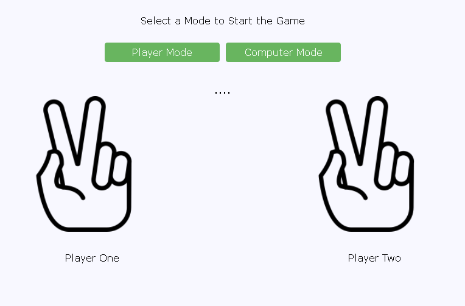
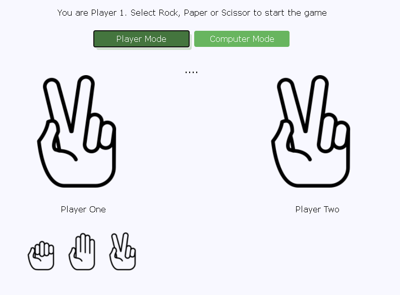
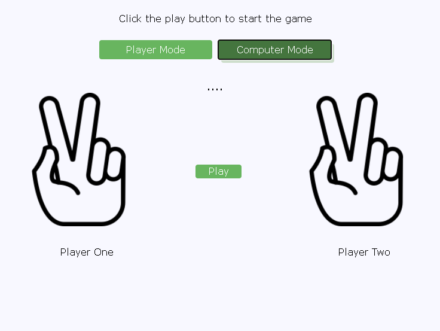

# Rock, Paper, Scissors

A hand game played between two individuals in which each player chooses Rock, Paper or Scissor and the winner of the round is determined by the following rules

- "Rock crushes Scissors"
- "Paper covers Rock" 
- "Scissors cuts Paper"

The game can end with either one of the players winning or it could end in a draw

# Rock, Paper, Scissors Online Game

This application has two modes of play

1. User vs Computer (Player Mode)
2. Computer vs Computer (Computer Mode)

</img>

# Player Mode 

User is always Player 1 and is required to choose Rock, Paper or Scissor to play the game

</img>

# Computer Mode 

In player mode, click the play button to play the game. 

</img>
